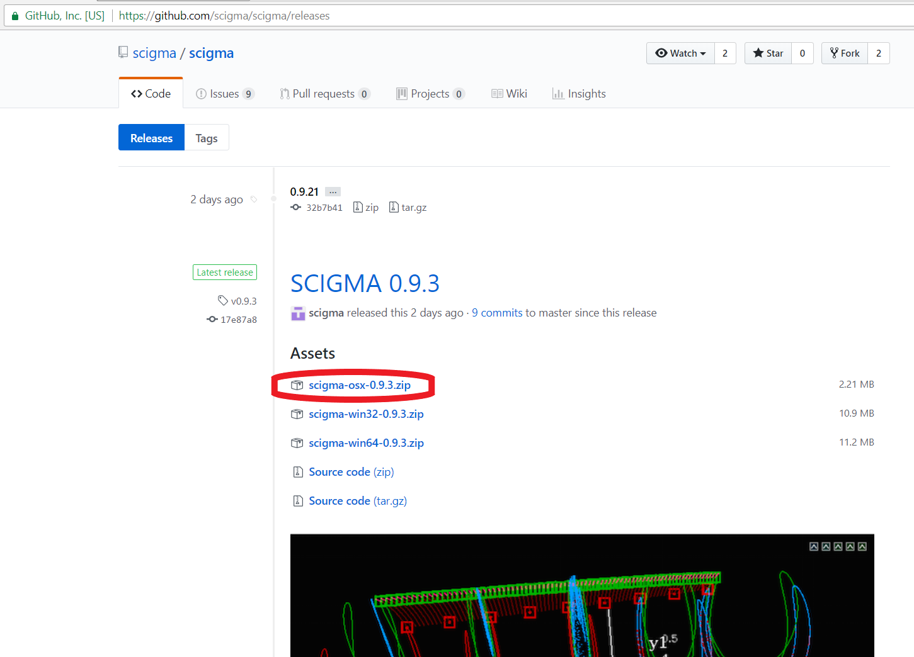
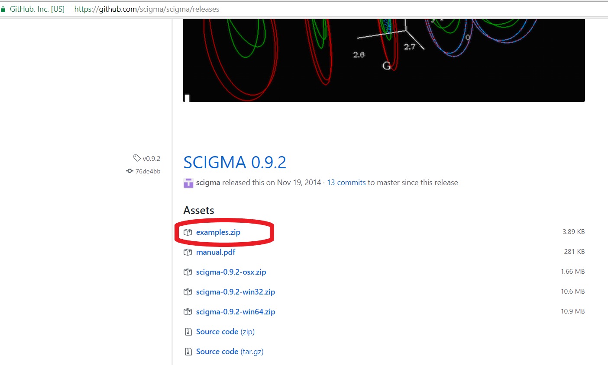
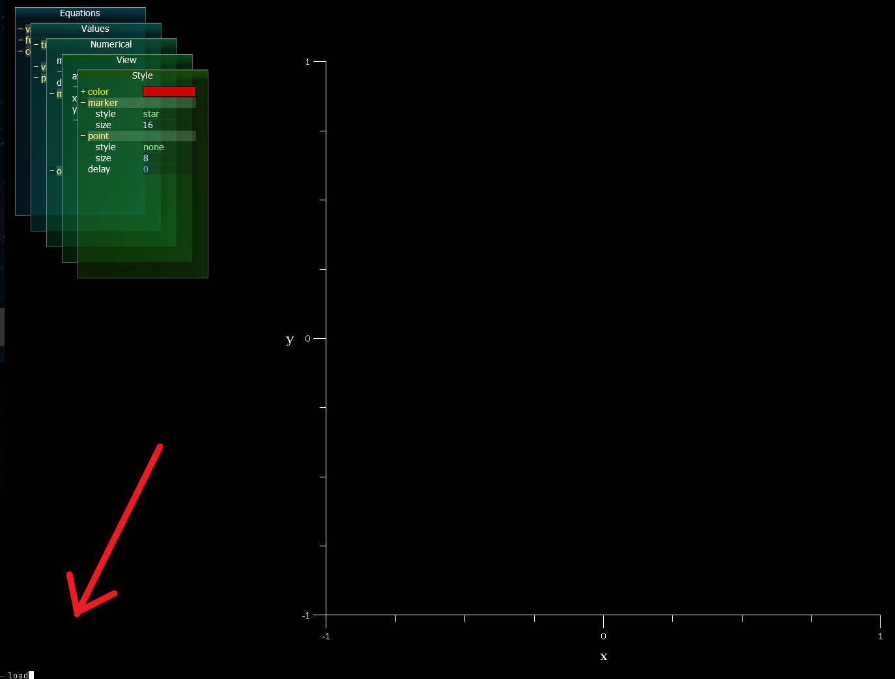
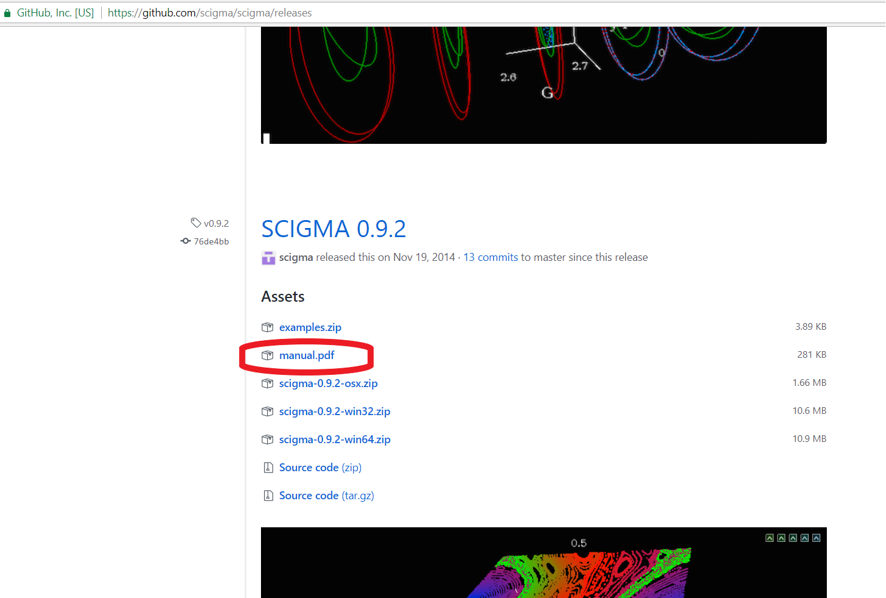

# Install on Macintosh

1. Downlad the latest scigma-osx-0.9.3.zip file from [the reseases page](https://github.com/scigma/scigma/releases) and extract its contents somewhere convenient.

2. Run runscigma.py , which is located in the extracted folder.

5. Download the examples.zip file from the [the releases page](https://github.com/scigma/scigma/releases) which is under the previous version (SCIGMA 0.9.2) and extract the folder.

6. Type 'load' on the SCIGMA console and browse to select a file in the Examples folder.

For more information, download manual.pdf under the 0.9.2 version at [the releases page](https://github.com/scigma/scigma/releases).

