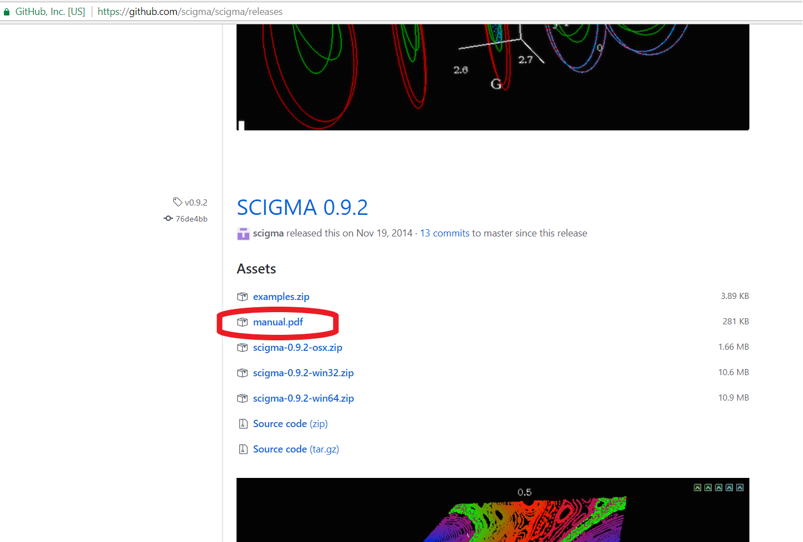

# Install on Windows

1. Download the latest Python 2.X "Windows x86-64 MSI installer" from [python.org](https://www.python.org/downloads/windows/).

    
    * Don't download Python 3.X.
    * Don't download the x86 (32-bit) installer, unless you have a 32 bit version of Windows.
    * [Anaconda Python](https://www.anaconda.com/download/#windows) will also work, with the same caveats. The download is bigger, but this is a better option if you're interested in learning more about Python programming.

2. Run the installer; default answers to everything are fine.

    

3. Download the latest scigma-win64-X.zip file from [the releases page](https://github.com/scigma/scigma/releases); extract the scigma-win64-X folder somewhere convenient.

    * Note that this is _not_ the scigma-master.zip file you may have downloaded using the "Clone or download" button on the [repository main page](https://github.com/scigma/scigma).
    * Note that if you have a different Windows version (32bit), you have to choose the respective Python installer and scigma zip file. 

    

4. In the extracted folder, double-click [runscigma.py](https://raw.githubusercontent.com/scigma/scigma/master/runscigma.py)3, or otherwise open with python.exe (which was probably installed to C:\Python27\python.exe).

    

5. Optionally, **right** click and drag runscigma.py to e.g. your desktop to make a (renamable) shortcut.

6. Download the examples.zip file from the [the releases page](https://github.com/scigma/scigma/releases) which is under the previous version (SCIGMA 0.9.2) and extract the folder.

7. Type 'load' on the SCIGMA console and browse to select a file in the Examples folder.

For more information, download manual.pdf under the 0.9.2 version at [the releases page](https://github.com/scigma/scigma/releases).

